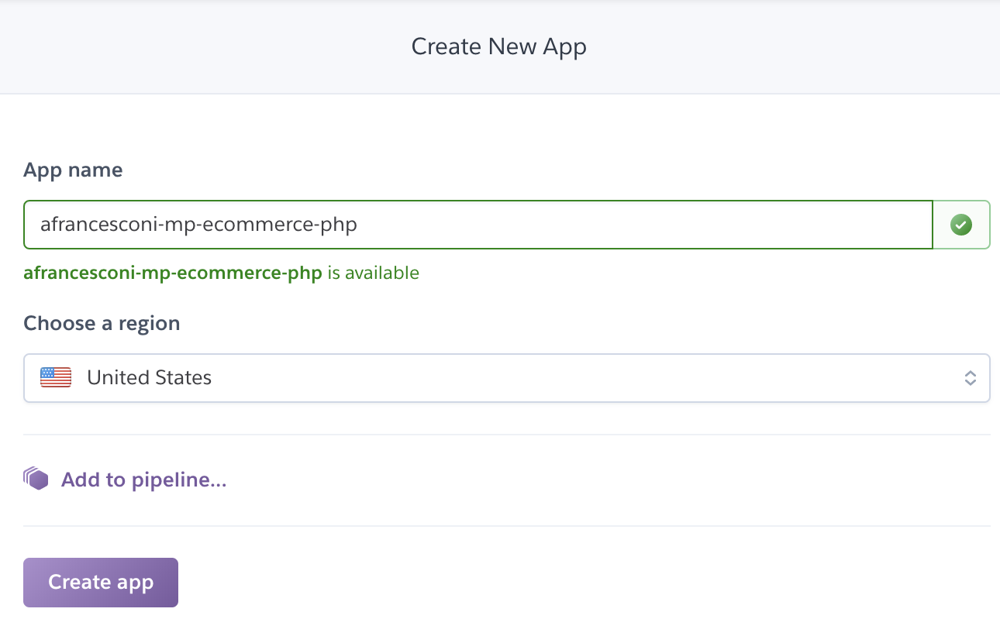
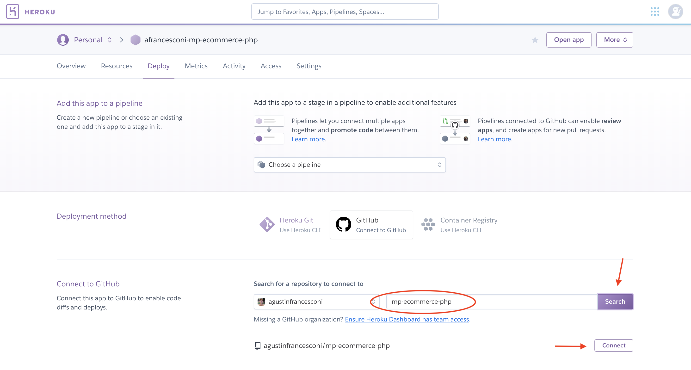
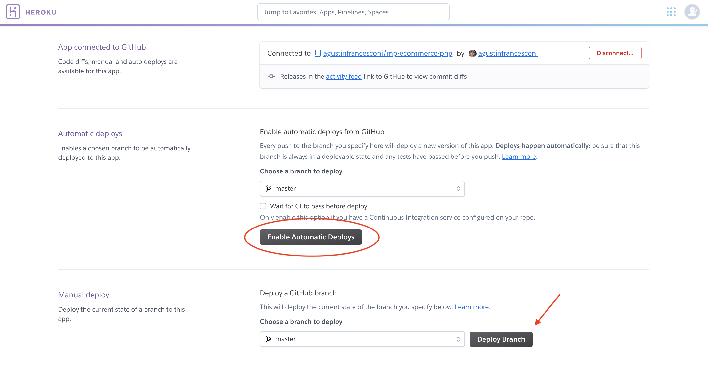

# mp-ecommerce

Este e-commerce de exemplo será a base para integração do Mercado Pago com `nodejs`.

## Antes de começar

Este aplicativo deve estar acessível através de um domínio público na internet antes de iniciar a integração e para isso usaremos [Heroku](https://heroku.com).

Requisitos para realizar a integração:

- Conta en GitHub.
- Conta en [Heroku](https://heroku.com).

## Tornando meu e-commerce de exemplo público

1. Faça um fork deste protótipo. Considerando que seu nome de usuário do GitHub é `username`, teremos o repositório https://github.com/username/mp-ecommerce-nodejs
2. Faça login na sua conta Heroku
3. Crie um aplicativo no Heroku para implantar nosso e-commerce. Nomeie-o como _username_-mp-commerce-nodejs. Exemplo:
<div style="text-align: center;" >

</div>

4. Conecte-se ao nosso aplicativo no Heroku o repositório "forkeado" na etapa 1
<div style="text-align: center;" >

</div>

5. Ative a implantação automática antes de qualquer alteração na ramificação "mestre". Implante manualmente, usando a opção "Deploy branch" para verificar se o aplicativo está funcionando corretamente.

<div style="text-align: center;" >

</div>

6.  Novamente, considerando que seu usuário do GitHub é `username` (substitua no URL pelo correto), acesse https://username-mp-ecommerce-nodejs.herokuapp.com/ e valide se o aplicativo está em execução. Você deve ver algo como o seguinte

<div style="text-align: center;" >

</div>

## Ambiente local

Para executar o aplicativo localmente, use o comando `npm`.

```
npm install && npm start
```
